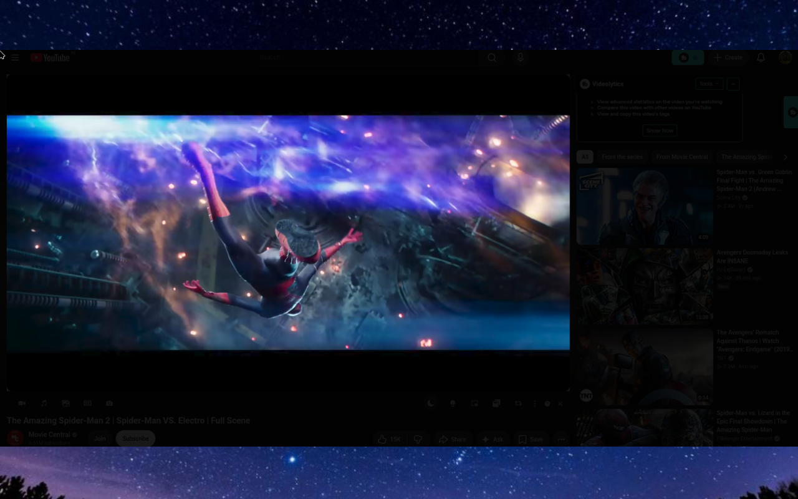
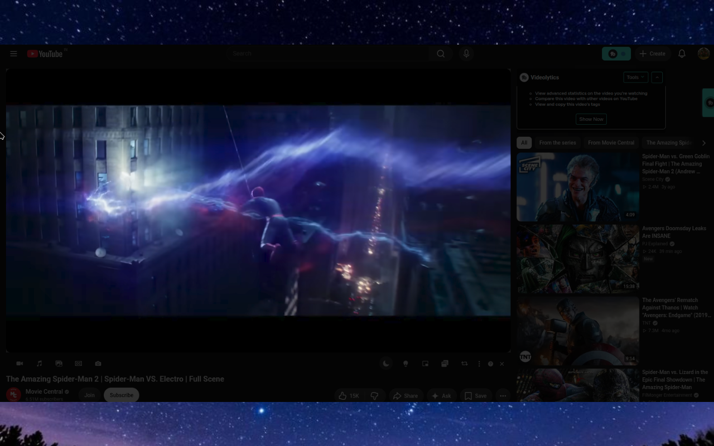
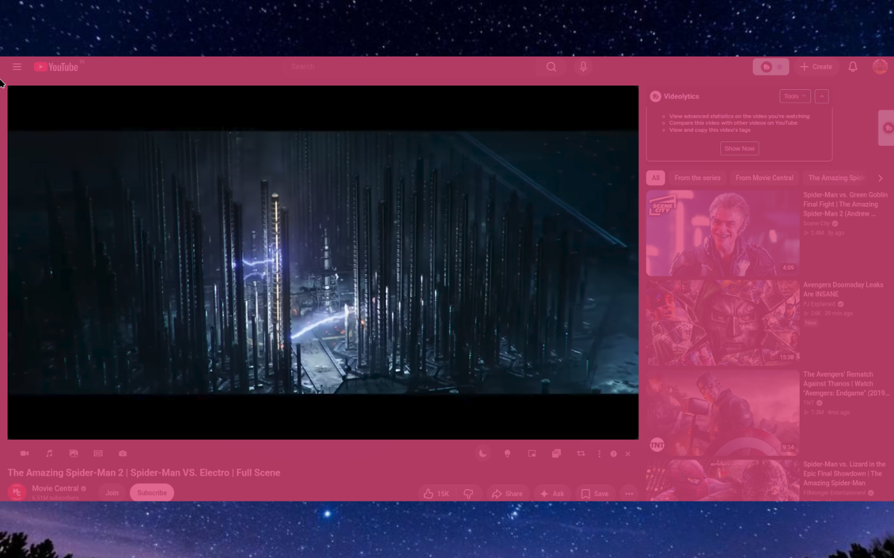

<div align="center">

# Nightveil

### A focused, lightweight dimming overlay for comfortable video watching in low-light environments.

Nightveil dims the area around the largest video on a webpage while keeping the video itself clear and unobstructed. It creates a simple, theater-like viewing experience without changing the page's content.

[](https://chromewebstore.google.com/detail/nightveil/ecffcapphcpckpclahhdlannppnkmcnj)
[](https://developer.chrome.com/docs/extensions/develop/migrate/what-is-mv3)
[](LICENSE)

</div>

---

## What is Nightveil?

**Nightveil** is a lightweight browser extension that adds a customizable translucent overlay around video content.

When enabled, Nightveil automatically detects the largest video on the current webpage and dims the surrounding area while leaving the video itself unobstructed.

The result is a more focused viewing experience, especially in dark rooms or at night.

No complicated controls. No changes to the website itself. Just a simple way to reduce the visual distraction around a video.

## Preview

<table>
  <tr>
    <td></td>
    <td></td>
  </tr>
  <tr>
    <td></td>
    <td></td>
  </tr>
</table>

## Features

- **Automatic video detection** - detects the largest video on the current webpage.
- **One-click activation** - enable the dimming effect when you want a more focused viewing experience.
- **Video stays clear** - the overlay dims the surrounding page rather than covering the video itself.
- **Adjustable opacity** - control how strong the dimming effect is.
- **Custom overlay colors** - choose the color of the surrounding overlay.
- **Per-site settings** - remember your preferred settings for individual websites.
- **Keyboard shortcut** - toggle the effect with `Ctrl + Shift + L`.
- **Lightweight** - designed to stay simple and use minimal resources.
- **No account required** - install it and use it immediately.
- **Privacy-focused** - the developer declares that Nightveil does not collect or use user data.

## How it works

```text
Open a webpage
      │
      ▼
Nightveil detects the largest video
      │
      ▼
Activate Nightveil
      │
      ▼
A translucent overlay dims the surrounding page
      │
      ▼
The video remains clear and unobstructed
```

## Use cases

### Watching videos at night

Reduce the brightness and visual distraction around a video when browsing in a dark environment.

### Theater-style viewing

Focus attention on the video without modifying the website's actual content.

### Low-light browsing

Create a darker viewing environment without forcing an entire webpage into a traditional dark mode.

### Focused media consumption

Keep the content you are watching visually separated from the rest of the page.

## Installation

### Chrome Web Store

Install the published extension directly from the Chrome Web Store:

**Nightveil:** https://chromewebstore.google.com/detail/nightveil/ecffcapphcpckpclahhdlannppnkmcnj

### From source

Clone the repository:

```bash
git clone https://github.com/Nucletic/Nightveil.git
cd Nightveil
```

Install dependencies:

```bash
npm install
```

Start the development build:

```bash
npm run dev
```

Build the extension:

```bash
npm run build
```

Create a distributable extension package:

```bash
npm run zip
```

For Firefox development/build targets:

```bash
npm run dev:firefox
npm run build:firefox
npm run zip:firefox
```

The project uses WXT for extension development and packaging.

## Loading the extension locally

After building the extension:

1. Open `chrome://extensions`
2. Enable **Developer mode**
3. Select **Load unpacked**
4. Choose the generated extension directory
5. Open a webpage containing a video
6. Activate Nightveil

## Usage

1. Open a webpage containing a video.
2. Activate Nightveil from the extension.
3. Nightveil detects the largest video on the page.
4. The surrounding area is dimmed while the video remains unobstructed.
5. Adjust the overlay opacity and color to your preference.
6. Toggle the effect off when finished.

You can also use:

```text
Ctrl + Shift + L
```

to toggle the effect.

## Settings

Nightveil supports configurable viewing preferences, including:

| Setting | Description |
| --- | --- |
| Overlay opacity | Controls how strongly the surrounding page is dimmed |
| Overlay color | Changes the color of the dimming layer |
| Site preferences | Remembers settings for individual websites |
| Toggle shortcut | `Ctrl + Shift + L` |

## Permissions

Nightveil requests the following browser permission:

| Permission | Purpose |
| --- | --- |
| `storage` | Stores extension settings and per-site preferences |

The extension is designed around a minimal permission footprint.

## Privacy

Nightveil's Chrome Web Store disclosure states that the developer does not collect or use user data.

The extension's privacy policy is available here:

https://night-veil.netlify.app/

## Tech stack

- React
- TypeScript
- WXT
- Chrome Extensions Manifest V3
- Chrome Storage API

The repository also includes Firefox build/package commands through WXT.

## Project structure

```text
Nightveil/
├── assets/
├── components/
├── entrypoints/
├── hooks/
├── public/
│   ├── icons/
│   └── store-screenshots/
│       ├── 1.png
│       ├── 2.png
│       └── 3.png
├── helper.ts
├── types.d.ts
├── wxt.config.ts
├── package.json
└── Readme.md
```

## Development scripts

| Command | Purpose |
| --- | --- |
| `npm run dev` | Start WXT development mode |
| `npm run build` | Build the Chrome extension |
| `npm run zip` | Create a distributable extension package |
| `npm run compile` | Type-check the project |
| `npm run dev:firefox` | Start Firefox development mode |
| `npm run build:firefox` | Build for Firefox |
| `npm run zip:firefox` | Package the Firefox build |

## Contributing

Contributions, bug reports, and feature ideas are welcome.

To contribute:

1. Fork the repository.
2. Create a feature branch.
3. Make your changes.
4. Run the type check and build.
5. Test the extension locally.
6. Open a pull request with a clear description.

Before submitting:

```bash
npm run compile
npm run build
```

## License

Nightveil is open source and available under the **MIT License**.

See [LICENSE](LICENSE) for the full license text.

---

<div align="center">

**Nightveil**

Dim the world around your video.

[Chrome Web Store](https://chromewebstore.google.com/detail/nightveil/ecffcapphcpckpclahhdlannppnkmcnj) · [GitHub](https://github.com/Nucletic/Nightveil)

</div>
